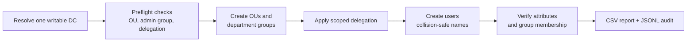

# AD_PS


**PowerShell automation for Active Directory provisioning, user lifecycle administration, and audit reporting, built for lab and test environments with production-style safety habits.**

AD_PS creates a department-based OU structure with scoped delegation, bulk-provisions test users, runs lifecycle operations (enable, disable, move, terminate, delete), and records every action as structured JSONL. Everything supports native `-WhatIf` / `-Confirm`, and every change is re-queried from the directory afterwards instead of assumed.

> **Scope:** Intended for lab, test, and controlled administrative use. Anything beyond a lab should go through your organization's change control and security review.

## Contents

- [Highlights](#highlights)
- [Quick start](#quick-start)
- [How a provisioning run works](#how-a-provisioning-run-works)
- [Default OU layout](#default-ou-layout)
- [Delegation model](#delegation-model)
- [Common usage](#common-usage)
- [Script reference](#script-reference)
- [Audit logging](#audit-logging)
- [Security model](#security-model)
- [Testing](#testing)
- [Limitations](#limitations)
- [Cleanup](#cleanup)
- [Troubleshooting](#troubleshooting)
- [Disclaimer](#disclaimer)

## Highlights

| Principle | What it means in practice |
| --- | --- |
| **Auditable** | Every operational script writes structured JSONL records before and after the action, not only on failure. |
| **Verified** | Lifecycle scripts re-query AD after a change (group membership, enabled state, password state) rather than trusting a cmdlet that returned without error. |
| **Previewable** | Native `-WhatIf` / `-Confirm` everywhere. There is no custom dry-run flag. |
| **Gated** | Destructive operations need an explicit switch such as `-AllowDestructiveOperation` on top of PowerShell's own confirmation. |
| **Rerun-safe** | Existing matching identities are detected before creation, so repeating a run does not produce duplicate or colliding accounts. |
| **Least privilege** | Department administrators get scoped lifecycle rights only. Attribute writes are reserved for a separate, explicitly reviewed group. |

## Quick start

**Requirements**

- Windows PowerShell 5.1 or PowerShell 7+
- The `ActiveDirectory` module (install RSAT if `Import-Module ActiveDirectory` fails)
- Network access to a writable domain controller
- An account with the delegated rights you intend to use
- A dedicated test OU and an approved change window

**Run it**

```powershell
# 1. Open the repo and confirm AD connectivity
Set-Location 'C:\Path\To\AD_PS-master'
Import-Module ActiveDirectory
Get-ADDomain

# 2. Preview (no changes; may still run read-only AD queries)
.\mark42.ps1 -AccountCount 5 -WhatIf

# 3. Create test users
.\mark42.ps1 -AccountCount 5

# 4. Snapshot what was created
.\Export-Test-Users.ps1 -OrganizationalUnitName 'Company'

# 5. Review the audit trail
.\Script_AD_Audit_Report.ps1

# 6. Clean up (preview first)
.\Remove-Test-Users.ps1 -OrganizationalUnitName 'Company' -WhatIf
.\Remove-Test-Users.ps1 -OrganizationalUnitName 'Company' -AllowDestructiveOperation
```

In multi-DC environments, pass `-Server <dc>` to choose the writable DC. If you omit it, one writable DC is resolved at startup and reused for the whole run, including verification and delegation ACL changes.

## How a provisioning run works



- Account names are checked against existing AD accounts and names generated in the same run before any suffixing.
- Users are enabled and their required department attributes validated immediately after creation.
- Failures capture structured error metadata, and the report includes execution context (domain, forest, DC, operator, timestamp, PowerShell version, OS).
- With `-RollbackCreatedAccountsOnFailure`, only accounts created by the current run are removed. See [Limitations](#limitations).

## Default OU layout

```text
Company
  Staff
    IT / HR / Finance / Sales        (default departments)
      Users
      Administrators
```

Employees are created in each department's `Users` OU. Department administrator accounts (and their groups) are created in `Administrators` by default; pass `-CreateDepartmentAdministrators:$false` to skip them. Use `-Departments` and `-OrganizationalUnitName` to change the layout.

## Delegation model

| Role | Can | Cannot |
| --- | --- | --- |
| `Department-Administrators` | Create and delete users in their department `Users` OU; list and read user objects there | Broad property writes |
| `Department-Attribute-Admins` | Reserved for explicitly reviewed attribute rights | Password reset, enable/disable, unlock, or anything else not individually granted |
| Audit and report consumers | Read the JSONL log and reports | Should have read-only access |

Safeguards around delegation:

- Administrator groups are validated by expected name, location, security category, Global scope, and SID.
- New delegation is granted only to a group **created during the current run**. A pre-existing group is accepted only if a SID-matched delegation ACE is already present.

## Common usage

```powershell
# Custom departments
.\mark42.ps1 -AccountCount 20 -Departments 'Engineering','Support','Operations'

# Custom names file and OU name
.\mark42.ps1 -NamesPath 'C:\Path\To\custom-names.txt' -OrganizationalUnitName '_LAB-USERS'

# Deterministic password pattern
.\mark42.ps1 -AccountCount 10 -PasswordPattern 'Training-{0}-Strong!'

# One shared password for all accounts
$securePassword = ConvertTo-SecureString 'Use-A-Strong-Lab-Password' -AsPlainText -Force
.\mark42.ps1 -AccountCount 5 -Password $securePassword

# Opt in to an encrypted credential export
.\mark42.ps1 -AccountCount 5 -ExportPasswords -PasswordFile '.\user-passwords.clixml'
```

Random passwords are generated unless you supply a pattern or a password. Custom patterns are checked against the domain default policy and any readable fine-grained policy metadata before creation starts; final enforcement still happens at creation time.

## Script reference

**Provisioning and cleanup**

| Script | Purpose |
| --- | --- |
| `mark42.ps1` | Bulk provisioning: OUs, groups, users, administrator accounts, CSV report |
| `ActiveDirectory-Provisioner.ps1` | Core provisioner (requires `-PasswordFile` when exporting) |
| `New_User_Script.ps1` | Create a single user with explicit attributes |
| `Export-Test-Users.ps1` | CSV snapshot of generated users |
| `Remove-Test-Users.ps1` | Lab cleanup entry point (wraps `2_RESET_TEST_USERS.ps1`) |
| `2_RESET_TEST_USERS.ps1` | Removes generated users, department groups, and optionally the OU tree |

**User lifecycle**

| Script | Purpose |
| --- | --- |
| `Script_Enable_User.ps1` / `Script_Disable_User.ps1` | Enable or disable an account |
| `Script_Move_User.ps1` | Move a user to a target OU |
| `Script_Terminate_User.ps1` | Disable, optionally move, and record a termination reason |
| `Script_Delete_User.ps1` | Delete an account (needs destructive approval) |
| `Script_Disable_Inactive_Users.ps1` | Disable accounts inactive beyond a threshold |

Termination keeps the existing description, avoids repeating the same dated note, refuses to exceed the AD description length limit, and verifies the final account state.

**Groups and account health**

| Script | Purpose |
| --- | --- |
| `Script_Add_User_to_Group.ps1` / `Script_Remove_User_from_Group.ps1` | Manage group membership |
| `Script_Reset_User_Passwords.ps1` | Reset one or more passwords |
| `Script_Unlock_User_Account.ps1` | Unlock an account |
| `Script_Find_Locked-Out_Users.ps1` | List locked accounts, optional CSV export |

**Reporting and tooling**

| Script / module | Purpose |
| --- | --- |
| `Script_AD_Audit_Report.ps1` | Summarize and filter the audit log; export CSV or JSON |
| `Script_AD_Security_Report.ps1` | Locked and inactive accounts, department coverage |
| `AD-Operations.psm1` | Shared helpers: DC targeting, identity resolution, audit logging, CSV utilities |
| `AD-Provisioning.psm1` | Provisioning logic and support functions |
| `validate_repo.ps1` | Parser validation for every script and module |
| `Tests\Run-OfflineTests.ps1` | Offline regression tests (no AD connection) |
| `nigerian-names.txt` | Default name source for generated users |

**Names file format:** one `First Surname` per line. Extra whitespace is tolerated, everything after the first token is treated as the surname, and blank or invalid lines are skipped with a warning.

## Audit logging

Records are written as JSON Lines to `AD-Operations.jsonl` by default, with these fields:

`Timestamp`, `Actor`, `Computer`, `Action`, `Target`, `TargetType`, `Status`, `Message`, `Details`, `Source`, `CorrelationId`

```powershell
.\Script_AD_Audit_Report.ps1                                        # summary
.\Script_AD_Audit_Report.ps1 -Identity 'chinedu.okafor'             # one identity
.\Script_AD_Audit_Report.ps1 -Action 'CreateUser' -Status 'Failed'  # filtered
```

Previews and declined confirmations are logged differently from attempted changes. If a change was attempted but a later verification or step failed, the status can be `CompletedWithErrors`. **Inspect the target object before retrying**, because part of the change may already have taken effect.

## Security model

**Credentials**

- Credential export is **off by default**. Use `-ExportPasswords` to opt in; `mark42.ps1` then writes `user-passwords.clixml` beside the script unless you pass `-PasswordFile`.
- Export requires Windows. The file is written with `Export-Clixml` (DPAPI, current user and machine), staged with a restrictive ACL, and published only after staging succeeds. Existing files are not replaced unless you pass `-OverwritePasswordFile`.
- The export is not a credential vault. Restrict access and set a retention policy.
- `-IncludePasswordInReport` writes **plaintext** passwords to the CSV. Avoid it except for a specifically approved need, and remove the report promptly.
- Avoid plaintext credentials in scripts, shell history, or shared folders.

**Operational**

- Shared AD context is restored in `finally`, including when validation or lookups fail.
- Audit logs and reports contain operator, machine, account, and OU data. Keep them local, access-controlled, and out of version control.
- Use a dedicated test OU and confirm the domain, OU path, and naming before any live run.

## Testing

Offline checks (no AD connection, no writes):

```powershell
.\validate_repo.ps1            # parse every script and module
.\Tests\Run-OfflineTests.ps1   # regression suite, prints pass/fail totals
```

The suite covers LDAP/DN escaping (including escaped commas), identity-not-found classification, termination descriptions, staged secure file publishing, opt-in credential export, secure-string cleanup, context cleanup, password generation and pattern parsing, name normalization, group validation, and SID-scoped delegation checks.

**Not covered:** AD provider behavior, Windows ACL enforcement, permissions, replication, and live rollback. Verify those in an authorized lab with a writable DC and a dedicated test OU. `-WhatIf` can still run read-only AD queries, so it is not an offline simulation.

## Limitations

- **Rollback is account-only.** `-RollbackCreatedAccountsOnFailure` removes accounts created by the current run. It does not remove OUs, groups, memberships, or delegated ACLs.
- **Partial failures continue.** With rollback enabled, an account-level verification or group-membership failure removes that account and the batch carries on. A failure outside account processing can still abort the run and roll back the remaining accounts from that invocation.
- **Cleanup ledger is in memory.** Each object is recorded with `CreatedByThisRun = $true/$false`, which is the basis for safer future cleanup. Pre-existing objects are never touched automatically.
- **`Department-Attribute-Admins` is a placeholder.** The group is created but granted no rights until you add reviewed, allow-listed ones.
- **Windows only** for credential export and ACL handling.

## Cleanup

```powershell
# Preview
.\Remove-Test-Users.ps1 -OrganizationalUnitName 'Company' -WhatIf

# Remove generated accounts
.\Remove-Test-Users.ps1 -OrganizationalUnitName 'Company' -AllowDestructiveOperation

# ...and the OU hierarchy
.\Remove-Test-Users.ps1 -OrganizationalUnitName 'Company' -RemoveOrganizationalUnit -AllowDestructiveOperation

# ...or everything under the test OU
.\Remove-Test-Users.ps1 -OrganizationalUnitName 'Company' -DeleteEverything -AllowDestructiveOperation
```

## Troubleshooting

| Symptom | What to check |
| --- | --- |
| AD module unavailable | `Get-Module -ListAvailable ActiveDirectory`, then install RSAT and `Import-Module ActiveDirectory` |
| Access denied | The account's delegated rights and reachability of the target DC |
| Names file not found | Use an absolute `-NamesPath`, or put the file beside the script |
| User creation fails | Read the emitted failure details. Usual causes: naming collisions, password-policy violations, missing permissions, DC reachability, or conflicting existing objects |

## Disclaimer

Outside `-WhatIf`, these scripts make real changes to Active Directory: creating accounts, resetting passwords, changing group membership, and deleting objects. Use them only where you are authorized, and always:

1. Preview with `-WhatIf`
2. Test on a small batch
3. Review the audit log
4. Confirm the domain, OU path, and naming
5. Follow change control for anything beyond a lab

<!-- Add before publishing: a LICENSE file and badge, a short terminal screenshot or GIF of a -WhatIf run, and a sample audit report output. -->
